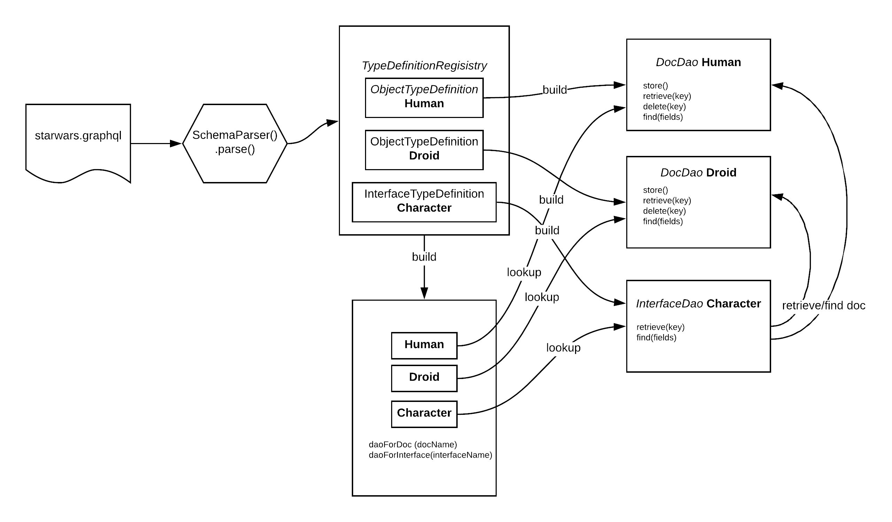

# Data Access (DAO)

The basics of document storage are managed by a number of generic data access layer 
(referred to as Data Access Objects or DAO) in the implementation code.

Individual documents are controlled by the 
[DocDao](https://github.com/ianmorgan/graph-store/blob/master/src/main/java/ianmorgan/graphstore/DocDao.kt), 
and Interfaces, which are always read only, are controlled the 
[InterfaceDao](https://github.com/ianmorgan/graph-store/blob/master/src/main/java/ianmorgan/graphstore/InterfaceDao.kt). 
Finally the 
[DocsDao](https://github.com/ianmorgan/graph-store/blob/master/src/main/java/ianmorgan/graphstore/DocsDao.kt) is 
simply a collection of all the daos.

External, read only, resources can be accessed by the 'external Dao' pattern, for which   
[ConfigurableRestDocDao](https://github.com/ianmorgan/graph-store/blob/master/src/main/java/ianmorgan/graphstore/dal/ConfigurableRestDocDao.kt) 
provides an 'out the box' implementation that should be sufficient in most cases.
see [External Data](externalData) for more detail.

Basically a DocDao is built for each type in the GraphQL schema and an InterfaceDao for each interface unless there is a Dao registered to access this
resource as external data. 

The rules for saving, retrieving and searching each DocDao are then driven from the GraphQL schema. 

This layer of the design essentially leverages a GraphQL schema to build a fairly standard resource style app that 
is exposed via a conventional REST style API. Probably more usefully, it is also used to drive data access for a 
full GraphQL query layer, see [Fetchers](fetchers).

A schematic of the basic wiring implemented by the DocsDao is below.

 

_[Original Diagram](https://www.lucidchart.com/invitations/accept/c1bc70c1-c36d-41fa-9e2b-9d27859fdabf)_