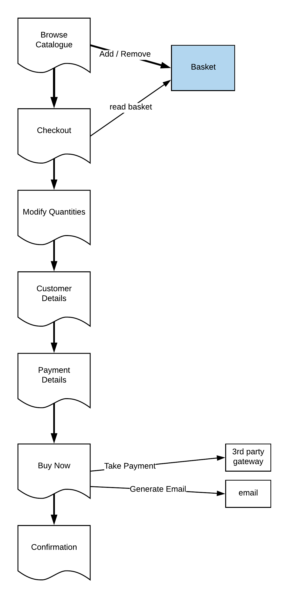

# Evolving a system around its Data

__WIP__, to be completed.

One problem with the evolution of software is finding central abstractions that 
grow without breaking. Often the core data abstractions are the most stable and commonly understood, which is a 
point Domain Driven Design (DDD) makes. Architectural patterns come and go (monoliths, backend MVC , browser  MVC, 
mircoservices, serverless, REST and so on), but the core data stays essentially unchanged. Also, as a business evolves the "flow" 
through the transactions will often alter which often has an unexpectedly large impact on the underlying components (
add ref to Camunda presentation), though again the impact on the underlying data is often quite minimal, just that 
its now collected and used in a different order.

 
Lets start with a simple online store.

## Version one, a simple order form 

The first version is a simple online form. It needs a simple catalogue published as web pages which our customer can 
browse, the ability to talk to a payment gateway to make a credit card payment and enough security to make sure user and 
credit cards details arent't inadvertently leaked. This is simple enough to build in just about any language / framework. 

The backend fulfilment processes can be manually, as long the customer gets their goods in time, they don't care. 

This is easily expressed as a simple [JSON](json/order-v1.json) document, which can be our initial schema.

And a very simple schematic of the site and the business process is

And the UI flow for the user is something like 

## Version two

The next version should be determined 

    

 